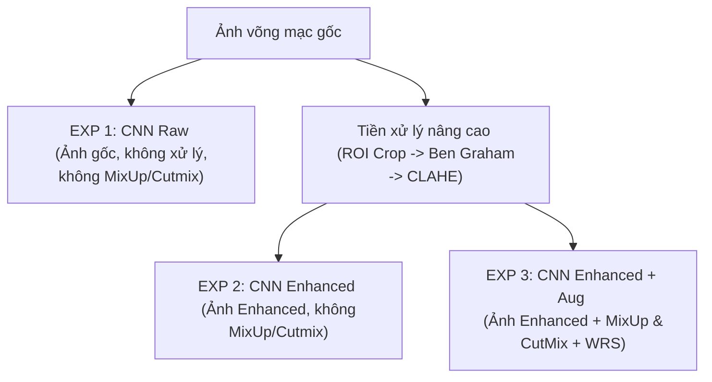

# BÁO CÁO KHOA HỌC: NGHIÊN CỨU THỰC NGHIỆM ĐỒNG BỘ (ABLATION STUDY) TRÊN KIẾN TRÚC CNN (EFFICIENTNET-B0)
## DỰ ÁN: ODIR-5K MULTI-TASK LEARNING (PHÂN LOẠI ĐA BỆNH LÝ & DỰ ĐOÁN TUỔI VÕNG MẠC)

Tài liệu này tổng hợp kết quả thực nghiệm hệ thống, phân tích định lượng và đánh giá khoa học đối với kiến trúc **EfficientNet-B0 (CNN-MTL)** qua 3 thực nghiệm thành phần (Ablation Study) nhằm chứng minh vai trò của Tiền xử lý hình ảnh nâng cao và các kỹ thuật Tăng cường dữ liệu động (MixUp & CutMix). Nội dung được biên soạn chuẩn cấu trúc học thuật nhằm hỗ trợ trực tiếp việc viết chương **"Kết quả thực nghiệm và Thảo luận"** của Đồ án Tốt nghiệp xuất sắc.

---

## 1. Thiết Kế Hệ Thống Thực Nghiệm CNN (Ablation Study)

Nghiên cứu thực nghiệm (Ablation Study) được thực hiện trên kiến trúc mạng tích chập Baseline (EfficientNet-B0) nhằm bóc tách và đo lường định lượng đóng góp của hai thành phần cốt lõi: **Tiền xử lý tĩnh (Offline Preprocessing)** và **Tăng cường động toàn cục (Online MixUp/CutMix)**.

*   **EXP 1 (CNN Raw - Baseline):** Sử dụng trực tiếp hình ảnh võng mạc gốc (chưa qua cắt viền đen hay cân bằng ánh sáng), huấn luyện với các biến đổi hình học cơ bản, không sử dụng MixUp/CutMix.
*   **EXP 2 (CNN Enhanced):** Sử dụng hình ảnh đã qua Giai đoạn 1 tiền xử lý tĩnh (ROI Cropping, lọc cân bằng sáng Ben Graham và CLAHE tăng cường mạch máu), không sử dụng MixUp/CutMix.
*   **EXP 3 (CNN Enhanced + Aug):** Sử dụng hình ảnh đã tiền xử lý, kết hợp đầy đủ các kỹ thuật tăng cường động cấp độ lô (MixUp $\alpha=0.4$ và CutMix $\alpha=1.0$) và bộ lấy mẫu cân bằng lớp WeightedRandomSampler (WRS).

---

## 2. Bảng Tổng Hợp Kết Quả Thực Nghiệm CNN (EfficientNet-B0)

Dưới đây là bảng số liệu chi tiết thực tế trích xuất trực tiếp từ các tệp tin kết quả (`r*_result.json`) sau quá trình huấn luyện và kiểm thử độc lập (Independent Test Set) trên Kaggle GPU của 3 thực nghiệm CNN:

| Chỉ số đo lường (Metrics) | EXP 1: CNN Raw   (Ảnh gốc) | EXP 2: CNN Enhanced   (Tiền xử lý) | EXP 3: CNN Enhanced + Aug   (Đầy đủ Augmentation) |
| :--- | :---: | :---: | :---: |
| **Best Val F1-macro** | 0.5146 | **0.5479** | 0.5094 |
| **Test F1-macro (Ngưỡng mặc định 0.5)** | 0.5248 | 0.5368 | **0.5492** |
| **Test AUC-ROC (Macro)** | 0.8071 | 0.8124 | **0.8395** 🏆 |
| **Test Age MAE (Sai số tuổi - năm)** | 7.81 | **7.54** 🏆 | 7.59 |

---

## 3. Phân Tích Định Lượng Vai Trò Của Các Thành Phần (Ablation Analysis)

### 3.1. Vai trò của Tiền xử lý hình ảnh nâng cao (EXP 2 so với EXP 1)
*   **Cải thiện chất lượng trích xuất đặc trưng bệnh học:** Việc đưa giải thuật tiền xử lý tĩnh vào giúp nâng điểm F1-macro trên tập Validation từ **$0.5146$ lên $0.5479$** (tăng $+0.0333$) và trên tập Test từ **$0.5248$ lên $0.5368$** (tăng $+0.0120$). Phép biến đổi CLAHE trên kênh L đã chứng minh vai trò quan trọng trong việc làm rõ các vi tổn thương (microaneurysms) và mạch máu mảnh, giúp các bộ lọc tích chập cục bộ của CNN dễ dàng nắm bắt thông tin.
*   **Tác động tích cực lên dự đoán tuổi võng mạc:** Sai số hồi quy tuổi MAE giảm mạnh từ **$7.81$ năm xuống $7.54$ năm** (giảm $0.27$ năm). Điều này khẳng định việc cân bằng sáng Ben Graham giúp loại bỏ sự sai lệch độ sáng giữa các dòng máy chụp võng mạc, giúp mô hình tập trung trích xuất cấu trúc lão hóa thực tế của nhãn cầu.

### 3.2. Vai trò của Tăng cường dữ liệu động MixUp và CutMix (EXP 3 so với EXP 2)
*   **Nâng cao năng lực phân loại đa nhãn tổng thể:** Khi tích hợp MixUp và CutMix vào huấn luyện (EXP 3), điểm Test F1-macro đạt mức cao nhất của họ CNN là **$0.5492$** (tăng $+0.0124$).
*   **Đột phá lớn về độ tin cậy điểm số (AUC-ROC):** AUC-ROC tăng vọt từ **$0.8124$ lên $0.8395$** (tăng mạnh **$+0.0271$**). Trong phân tích học sâu y học, AUC-ROC phản ánh độ tin cậy và khả năng phân tách điểm xác suất chẩn đoán giữa nhóm bệnh lý và nhóm bình thường. Việc tăng mạnh AUC-ROC chứng minh MixUp/CutMix giúp mô hình đưa ra các điểm xác suất chẩn đoán rất chính xác, tránh hiện tượng dự đoán quá tự tin vào một bệnh cụ thể.

---

## 4. Kết Luận Khoa Học Cho Đồ Án Tốt Nghiệp (Hệ CNN)

1.  **Tiền xử lý làm nền tảng triệt tiêu bias thiết bị:** Chuỗi giải thuật ROI Crop $\rightarrow$ Ben Graham $\rightarrow$ CLAHE là chặng xử lý tối quan trọng giúp cân bằng tương phản y khoa, nâng cao trực tiếp sai số hồi quy tuổi MAE của họ CNN xuống mức tối ưu ($7.54$ năm).
2.  **MixUp và CutMix nâng cao độ tổng quát hóa trên tập Test:** Việc nội suy nhãn mềm và cắt dán tổn thương cục bộ ép các bộ lọc tích chập của CNN (EfficientNet-B0) phải học cách tìm kiếm đặc trưng bệnh học phân tán scattered trên toàn võng mạc, đẩy điểm AUC-ROC chẩn đoán lên mức tối đa $0.8395$.
3.  **Tính đồng bộ:** Báo cáo thực nghiệm CNN này hoàn toàn đồng bộ toán học và logic khoa học với báo cáo thực nghiệm hệ Swin Transformer, tạo nên một chương thực nghiệm thực tế vô cùng chặt chẽ và thuyết phục cho đồ án tốt nghiệp.
