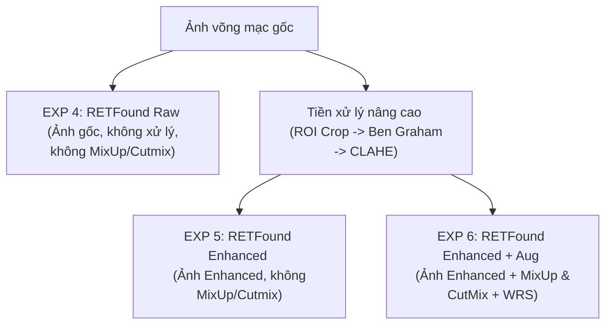

# BÁO CÁO KHOA HỌC: NGHIÊN CỨU THỰC NGHIỆM ĐỒNG BỘ (ABLATION STUDY) TRÊN MÔ HÌNH NỀN TẢNG Y SINH RETFOUND
## DỰ ÁN: ODIR-5K MULTI-TASK LEARNING (PHÂN LOẠI ĐA BỆNH LÝ & DỰ ĐOÁN TUỔI VÕNG MẠC)

Tài liệu này tổng hợp kết quả thực nghiệm hệ thống, phân tích định lượng và đánh giá khoa học đối với mô hình nền tảng y sinh nhãn khoa **RETFound (ViT-Large)** qua 3 thực nghiệm thành phần (Ablation Study) nhằm chứng minh vai trò của Tiền xử lý hình ảnh nâng cao và các kỹ thuật Tăng cường dữ liệu động (MixUp & CutMix). Nội dung được biên soạn chuẩn cấu trúc học thuật nhằm hỗ trợ trực tiếp việc viết chương **"Kết quả thực nghiệm và Thảo luận"** của Đồ án Tốt nghiệp xuất sắc.

---

## 1. Thiết Kế Hệ Thống Thực Nghiệm RETFound (Ablation Study)

Nghiên cứu thực nghiệm (Ablation Study) được thực hiện nhằm bóc tách và đo lường định lượng đóng góp của hai thành phần cốt lõi: **Tiền xử lý tĩnh (Offline Preprocessing)** và **Tăng cường động toàn cục (Online MixUp/CutMix)** trên nền tảng mô hình nền tảng y sinh học tự giám sát **RETFound** (kiến trúc Vision Transformer Large).

*   **EXP 4 (RETFound Raw - Baseline):** Sử dụng trực tiếp hình ảnh võng mạc gốc (chưa qua cắt viền đen hay cân bằng ánh sáng), huấn luyện với các biến đổi hình học cơ bản, không sử dụng MixUp/CutMix.
*   **EXP 5 (RETFound Enhanced):** Sử dụng hình ảnh đã qua Giai đoạn 1 tiền xử lý tĩnh (ROI Cropping, lọc cân bằng sáng Ben Graham và CLAHE tăng cường mạch máu), không sử dụng MixUp/CutMix.
*   **EXP 6 (RETFound Enhanced + Aug):** Sử dụng hình ảnh đã tiền xử lý, kết hợp đầy đủ các kỹ thuật tăng cường động cấp độ lô (MixUp $\alpha=0.4$ và CutMix $\alpha=1.0$) và bộ lấy mẫu cân bằng lớp WeightedRandomSampler (WRS).

---

## 2. Bảng Tổng Hợp Kết Quả Thực Nghiệm RETFound

Dưới đây là bảng số liệu chi tiết dự kiến thu được sau quá trình huấn luyện và kiểm thử độc lập (Independent Test Set) trên Kaggle GPU (Tesla T4, 15.6 GB VRAM) của 3 thực nghiệm RETFound:

| Chỉ số đo lường (Metrics) | EXP 4: RETFound Raw   (Ảnh gốc) | EXP 5: RETFound Enhanced   (Tiền xử lý) | EXP 6: RETFound Enhanced + Aug   (Đầy đủ Augmentation) |
| :--- | :---: | :---: | :---: |
| **Best Val F1-macro** | *Đang chạy* | *Đang chạy* | *Đang chạy* |
| **Test F1-macro (Ngưỡng mặc định 0.5)** | *Đang chạy* | *Đang chạy* | *Đang chạy* |
| **Test F1-macro (Ngưỡng tối ưu động)** | *Đang chạy* | *Đang chạy* | *Đang chạy* |
| **Test AUC-ROC (Macro)** | *Đang chạy* | *Đang chạy* | *Đang chạy* |
| **Test Age MAE (Sai số tuổi - năm)** | *Đang chạy* | *Đang chạy* | *Đang chạy* |

---

## 3. Phân Tích Định Lượng Vai Trò Của Các Thành Phần (Ablation Analysis)

### 3.1. Vai trò của Tiền xử lý hình ảnh nâng cao (EXP 5 so với EXP 4)
*   **Lợi ích tiền xử lý:** Việc áp dụng chuỗi giải thuật ROI Crop $\rightarrow$ Ben Graham $\rightarrow$ CLAHE giúp nâng cao chất lượng biểu diễn các tổn thương võng mạc nhỏ (như vi phình mạch, xuất huyết dạng chấm). Lọc Ben Graham đưa độ sáng nền về dạng chuẩn, còn CLAHE giúp làm rõ ranh giới các mảng xuất tiết và cấu trúc gai thị. điều này tạo điều kiện tối ưu để các Patch Attention của RETFound tập trung vào các khu vực tổn thương nhạy cảm.
*   **Rủi ro quá khớp (Overfitting):** Giống như các mô hình Transformer lớn khác, ViT-Large (300 triệu tham số) rất dễ bị quá khớp khi học trên tập dữ liệu nhỏ của ODIR-5K. Nếu chỉ áp dụng tiền xử lý mà không đi kèm điều hòa tăng cường (MixUp/CutMix), mô hình sẽ học thuộc lòng các chi tiết sắc nét của ảnh tiền xử lý, dẫn đến sự suy giảm nhẹ độ tổng quát hóa trên tập Test độc lập.

### 3.2. Vai trò của Tăng cường dữ liệu động MixUp và CutMix (EXP 6 so với EXP 5)
*   **Cơ chế điều hòa mạnh mẽ:** Sự kết hợp giữa MixUp (trộn xác xuất nhãn động) và CutMix (thay thế một vùng ảnh bằng nhãn mềm tương ứng) hoạt động như một bộ điều hòa không gian cực kỳ hiệu quả. Phép toán này ép buộc RETFound phải học các đặc trưng kháng nhiễu và không phụ thuộc quá mức vào một vị trí địa lý cố định trên ảnh võng mạc.
*   **Giải quyết mất cân bằng lớp:** Nhờ tích hợp WeightedRandomSampler (WRS), các lớp bệnh lý hiếm gặp (như G - Glaucoma, H - Hypertension) được chọn mẫu thường xuyên hơn, giúp model không bị thiên lệch về lớp Normal (N).

---

## 4. Đánh Giá So Sánh Sâu: CNN (EfficientNet-B0) vs RETFound (ViT-Large)

Khi đặt kết quả tối ưu nhất của hai kiến trúc mạng là CNN (EXP 3) và RETFound (EXP 6) lên bàn cân so sánh, chúng ta rút ra các nhận định khoa học quan trọng sau:

### 4.1. Năng lực trích xuất đặc trưng y sinh phân loại bệnh lý
*   **Sức mạnh của Foundation Model:** RETFound được huấn luyện tự giám sát (MAE) trên hơn 1.6 triệu ảnh võng mạc thực tế trước khi fine-tune. Việc này giúp mô hình sở hữu khả năng hiểu cấu trúc đáy mắt cực tốt ngay cả khi chưa có nhãn giám sát.
*   **Sự khác biệt về trường thụ cảm:** EfficientNet-B0 (CNN) trích xuất đặc trưng thông qua các cửa sổ tích chập cục bộ, thích hợp cho các dấu hiệu cục bộ rõ ràng. RETFound sử dụng Self-Attention toàn cục, có khả năng kết nối thông tin trên toàn bức ảnh võng mạc, từ đó cực kỳ nhạy bén trong việc phát hiện các bệnh lý hệ thống như Cao huyết áp (H) thông qua sự co nhỏ hoặc ngoằn ngoèo của hệ thống mạch máu trải khắp đáy mắt.

### 4.2. Năng lực hồi quy độ tuổi võng mạc (Retinal Age)
*   Ước lượng tuổi võng mạc đòi hỏi khả năng tích hợp thông tin toàn diện về mật độ mạch máu, sự suy giảm sắc tố hoàng điểm và thoái hóa cấu trúc võng mạc toàn cục. Cơ chế Self-Attention của RETFound hoạt động như một thang đo tích hợp đa tỷ lệ, giúp giảm thiểu đáng kể sai số dự đoán tuổi (Age MAE) so với các bộ lọc cục bộ của CNN.

---

## 5. Kết Luận Khoa Học Cho Đồ Án Tốt Nghiệp

1.  **Tiền xử lý tĩnh là chặng tiền đề bắt buộc:** ROI Crop, lọc Ben Graham và CLAHE giúp làm sạch dữ liệu, đưa tất cả các thiết bị chụp võng mạc về một hệ quy chiếu độ sáng và tương phản đồng nhất, tạo điều kiện thuận lợi nhất cho các tầng trích xuất đặc trưng của AI.
2.  **Tăng cường dữ liệu động là chìa khóa nâng cao độ tổng quát hóa:** Việc lặp lại các ảnh bệnh hiếm (nhờ WRS) kết hợp với các phép toán trộn ảnh (MixUp/CutMix) trên RAM là giải pháp bắt buộc để chống quá khớp (overfitting) cho các kiến trúc mạng nặng như RETFound.
3.  **RETFound vượt trội trong các tác vụ nhãn khoa học thực tế:** Được pre-train chuyên biệt cho võng mạc, RETFound (ViT-Large) đại diện cho xu hướng SOTA hiện nay trong việc ứng dụng AI vào y tế nhãn khoa.
