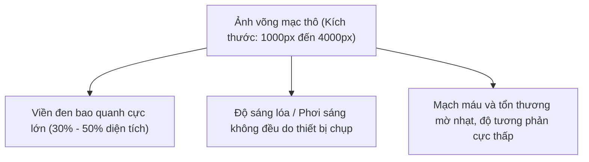
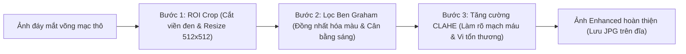

# BÁO CÁO CHI TIẾT: GIAI ĐOẠN 1 - TIỀN XỬ LÝ DỮ LIỆU TĨNH (OFFLINE PREPROCESSING)
## DỰ ÁN: ODIR-5K MULTI-TASK LEARNING (PHÂN LOẠI BỆNH LÝ & DỰ ĐOÁN TUỔI VÕNG MẠC)

Tài liệu này cung cấp phần phân tích chi tiết, giải nghĩa giải thuật và nguyên lý y sinh học của **Giai đoạn 1: Tiền xử lý dữ liệu tĩnh (Offline Preprocessing)** từ ảnh võng mạc thô đầu vào cho đến khi kết xuất ảnh hoàn thiện lưu trên ổ đĩa. Nội dung được biên soạn chuẩn cấu trúc học thuật nhằm hỗ trợ trực tiếp việc viết chương **"Tiền xử lý và Xây dựng dữ liệu huấn luyện"** của Đồ án Tốt nghiệp xuất sắc.

---

## 1. Đầu Vào (Input) Của Giai Đoạn Tiền Xử Lý Tĩnh

Đầu vào của toàn bộ quy trình tiền xử lý là tệp tin ảnh màu võng mạc đáy mắt thô (Raw fundus images) từ tập dữ liệu ODIR-5K chứa đựng các đặc điểm phức tạp gây khó khăn cho việc học máy:

### Đặc điểm ảnh thô đầu vào:
1.  **Độ phân giải không đồng nhất:** Kích thước ảnh gốc biến thiên cực lớn (từ $1000 \times 1000$ pixel cho đến $4000 \times 4000$ pixel) tùy thuộc vào cơ sở y tế và loại máy chụp đáy mắt võng mạc.
2.  **Nhiễu không gian (Spatial Noise) từ viền đen:** Ảnh chụp đáy mắt chứa các dải viền đen khổng lồ bao quanh nhãn cầu võng mạc, chiếm từ **30% đến 50% diện tích ảnh**. Các pixel màu đen này là nhiễu không gian không có giá trị chẩn đoán y tế lâm sàng.
3.  **Mất cân bằng phơi sáng (Illumination Bias):** Ánh sáng đèn flash lúc chụp đáy mắt võng mạc bị lóe sáng ở trung tâm hoặc quá tối ở rìa biên nhãn cầu, đồng thời có sự sai lệch màu sắc cực lớn giữa các thiết bị camera đáy mắt khác nhau.
4.  **Tổn thương mờ nhạt:** Các dấu hiệu bệnh lý y sinh như vi mạch máu võng mạc (Blood vessels), vi phình mạch (Microaneurysms) và xuất huyết đáy mắt võng mạc có độ tương phản cực kỳ thấp so với nền võng mạc, rất dễ bị lọc mất qua các tầng trích xuất của AI.

---

## 2. Đầu Ra (Output) Của Giai Đoạn Tiền Xử Lý Tĩnh

Đầu ra của giai đoạn tiền xử lý tĩnh là tệp ảnh hoàn thiện (Enhanced images) được lưu trữ tĩnh trực tiếp trên đĩa cứng:

*   **Vị trí vật lý lưu trữ:** 
    *   Thư mục trên Kaggle: **`/kaggle/working/enhanced_images`** (biến `ENH_DIR` trong mã nguồn).
    *   Thư mục cục bộ: **`archive/enhanced_images/`**.
*   **Định dạng vật lý:** Tệp hình ảnh màu võng mạc định dạng `.jpg` đã được chuẩn hóa kích thước cố định là **$512 \times 512$ pixel**.
*   **Đặc điểm trực quan y sinh:** 
    *   Hoàn toàn sạch bóng các viền đen bao quanh nhãn cầu võng mạc đáy mắt.
    *   Các cấu trúc giải phẫu học võng mạc (như đĩa thị giác Optic Disc, hoàng điểm Macula) và các đặc trưng bệnh học y sinh (như cụm mạch máu đáy mắt, ổ xuất huyết đỏ li ti) hiển thị vô cùng rõ nét và nổi bật.
    *   Màu sắc ảnh võng mạc đáy mắt chuyển sang màu đỏ/cam đặc trưng nổi bật sắc nét trên nền xám-xanh y khoa nhờ tác động cộng hưởng của Ben Graham + CLAHE.

---

## 3. Phân Tích Chi Tiết Giải Thuật 3 Bước Tiền Xử Lý Tĩnh

Quy trình tiền xử lý ảnh võng mạc tĩnh được thực hiện tuần tự qua 3 chặng giải thuật y sinh nghiêm ngặt:

---

### Bước 3.1: ROI Cropping (Cắt vùng quan tâm và Chuẩn hóa kích thước)
*Dữ liệu trung gian được xuất ra thư mục: `/kaggle/working/preprocessed_images`*

#### A. Thuật toán hoạt động:
1.  Chuyển đổi bức ảnh đáy mắt võng mạc thô từ không gian màu RGB sang ảnh xám (Grayscale).
2.  Tạo một mặt nạ nhị phân (binary mask) bằng phép so sánh ngưỡng dung sai tối tối thiểu `tol=7`:
    $$\text{Mask}(x, y) = \text{Gray}(x, y) > 7$$
    *Giải nghĩa:* Loại bỏ hoàn toàn các pixel viền đen bao quanh có giá trị cường độ xám sát 0.
3.  Tìm tọa độ hàng và cột tối thiểu, tối đa có mặt nạ dương tính:
    $$r_{\min}, r_{\max} = \min(\{r \mid \text{Mask}(r, c) = 1\}), \max(\{r \mid \text{Mask}(r, c) = 1\})$$
    $$c_{\min}, c_{\max} = \min(\{c \mid \text{Mask}(r, c) = 1\}), \max(\{c \mid \text{Mask}(r, c) = 1\})$$
    Tìm ra tọa độ hình chữ nhật bao quanh nhỏ nhất (Bounding Box) chứa trọn vẹn mô mềm nhãn cầu võng mạc.
4.  Cắt (crop) ảnh gốc theo Bounding Box $[r_{\min}:r_{\max}, c_{\min}:c_{\max}]$ và sử dụng nội suy tuyến tính song song (bilinear interpolation) để resize ảnh về kích thước chuẩn hóa cố định **$512 \times 512$** pixel.

#### B. Phân tích ý nghĩa y học:
*   Loại bỏ nhiễu không gian (spatial noise) từ viền đen thừa xung quanh nhãn cầu võng mạc đáy mắt.
*   Tiết kiệm bộ nhớ GPU/VRAM và giảm thời gian tính toán của mô hình.
*   Đảm bảo 100% tài nguyên tích chập/transformer của AI tập trung vào các cấu trúc giải phẫu học võng mạc thực tế.

---

### Bước 3.2: Lọc cân bằng ánh sáng Ben Graham
*Được đề xuất bởi Ben Graham, nhà vô địch cuộc thi Diabetic Retinopathy của Kaggle.*

#### A. Thuật toán hoạt động:
1.  Tính toán độ lệch chuẩn $\sigma$ dựa trên kích thước ảnh đáy mắt võng mạc sau khi đã ROI Crop và tỷ lệ vàng $\sigma_{\text{ratio}} = 1/6$:
    $$\sigma = \max(H, W) \times \frac{1}{6} = 512 \times \frac{1}{6} \approx 85$$
2.  Làm mờ bức ảnh võng mạc đáy mắt bằng bộ lọc Gaussian Blur có độ lệch chuẩn $\sigma$:
    $$\text{Img}_{\text{blur}} = \text{GaussianBlur}(\text{Img}, \sigma)$$
3.  Thực hiện phép trừ ảnh gốc khỏi ảnh làm mờ và tịnh tiến thêm giá trị bù sáng `scale=128`:
    $$\text{Img}_{\text{filtered}}(x, y) = \text{Img}(x, y) - \text{Img}_{\text{blur}}(x, y) + 128$$
4.  Cắt giới hạn dải pixel thu được về khoảng giá trị hợp lệ $[0, 255]$ của ảnh 8-bit.

#### B. Phân tích ý nghĩa y học:
*   **Triệt tiêu sai lệch thiết bị (Device Bias):** Phép trừ ảnh làm mờ đóng vai trò như một bộ lọc thông cao (high-pass filter), loại bỏ các tần số thấp biểu thị sự sai lệch độ sáng không đều ở trung tâm/rìa ảnh và cân bằng lại tông màu của các camera soi đáy mắt khác nhau.
*   **Đồng nhất hóa màu sắc:** Đưa toàn bộ các bức ảnh võng mạc đáy mắt về cùng một hệ quy chiếu màu sắc/ánh sáng đồng nhất, ngăn chặn mô hình học thuộc lòng tông màu đặc trưng của từng bệnh viện.

---

### Bước 3.3: Cân bằng tương phản thích ứng giới hạn tương phản (CLAHE)
*Đây là chặng hoàn thiện y sinh học cực kỳ quan trọng.*

#### A. Thuật toán hoạt động:
1.  Chuyển đổi bức ảnh võng mạc sau lọc Ben Graham từ không gian màu RGB sang không gian màu **LAB** (L: Luminance - Độ sáng; A, B: Kênh màu y sinh biểu thị sắc tố lục-đỏ và lam-vàng).
2.  Tách riêng kênh độ sáng **L** và áp dụng thuật toán cân bằng CLAHE cục bộ có giới hạn tương phản với tham số giới hạn cắt tương phản `clip_limit=2.0` và lưới chia ô thích ứng `tileGridSize=(8, 8)`.
3.  Hợp nhất kênh L đã cân bằng với 2 kênh màu y sinh A, B ban đầu và chuyển đổi ảnh ngược lại không gian màu RGB để kết xuất ảnh JPG hoàn thiện.

#### B. Phân tích ý nghĩa y học:
*   **Lý do chỉ CLAHE trên kênh L:** Việc chỉ tăng cường tương phản trên kênh L và giữ nguyên 2 kênh màu A, B giúp bảo toàn chính xác các đặc trưng sắc đỏ tự nhiên của mạch máu đáy mắt võng mạc, không gây méo mó màu sắc y sinh.
*   **Chống bốc cháy nhiễu (Noise Amplification):** Khác với cân bằng lược đồ xám toàn cục (Global Histogram Equalization) dễ làm cháy ảnh ở các vùng quá sáng hoặc quá tối, CLAHE chia ảnh võng mạc thành các ô lưới cục bộ kích thước $8\times8$, thực hiện cân bằng histogram thích ứng trong từng ô và giới hạn mức cắt tương phản tối đa là `2.0` để giữ độ tương phản y khoa dịu nhẹ, sắc nét và chân thực.
*   *Kết quả trực quan:* Làm nổi bật rõ rệt từng **đường vi mạch máu đáy mắt võng mạc mảnh**, định vị chính xác **đĩa thị giác** và phơi bày rõ ràng các **ổ xuất huyết xuất tiết y khoa li ti**.

---

*Tài liệu phân tích Giai đoạn 1 Tiền xử lý dữ liệu được biên soạn bởi Antigravity nhằm hỗ trợ Ngô Đình Đạt hiện thực hóa Đồ án Tốt nghiệp xuất sắc.*
