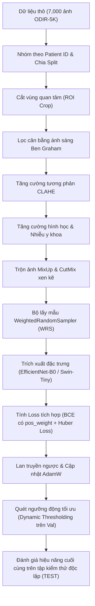

# BÁO CÁO TOÀN DIỆN VỀ QUY TRÌNH HỆ THỐNG END-TO-END VÀ KẾT QUẢ THỰC NGHIỆM
## DỰ ÁN: ODIR-5K MULTI-TASK LEARNING (PHÂN LOẠI 8 BỆNH LÝ VÀ DỰ ĐOÁN TUỔI VÕNG MẠC)

Báo cáo này cung cấp cái nhìn toàn cảnh, chi tiết học thuật và kỹ thuật về toàn bộ hệ thống từ xử lý dữ liệu đầu vào đến huấn luyện, tối ưu hóa và trực quan hóa giải thích được (XAI). Tài liệu này được thiết kế theo chuẩn đề cương khoa học nhằm phục vụ trực tiếp cho việc viết báo cáo Đồ án Tốt nghiệp xuất sắc.

---

## 1. Tổng Quan Bài Toán và Dữ Liệu ODIR-5K

### 1.1. Bài toán Đa nhiệm (Multi-task Learning - MTL)
Hệ thống giải quyết đồng thời hai bài toán y tế đáy mắt phức tạp từ một ảnh đầu vào duy nhất:
1.  **Phân loại Đa nhãn (Multi-label Classification):** Chẩn đoán xác suất mắc 8 nhóm bệnh lý đáy mắt:
    *   **N** (Normal): Võng mạc bình thường.
    *   **D** (Diabetes Retinopathy): Bệnh võng mạc tiểu đường.
    *   **G** (Glaucoma): Thiên đầu thống.
    *   **C** (Cataract): Đục thủy tinh thể.
    *   **A** (Age-related Macular Degeneration): Thoái hóa điểm vàng tuổi già.
    *   **H** (Hypertension Retinopathy): Bệnh võng mạc cao huyết áp.
    *   **M** (Pathological Myopia): Cận thị bệnh lý đáy mắt.
    *   **O** (Other Diseases): Các bệnh lý võng mạc khác.
2.  **Dự đoán Tuổi Sinh Học (Age Regression):** Hồi quy tuổi võng mạc để phát hiện lão hóa sớm hoặc các mối liên quan y học giữa tuổi tác và các tổn thương võng mạc.

### 1.2. Thách thức lớn của tập dữ liệu ODIR-5K
*   **Mất cân bằng lớp cực đoan:** Lớp bình thường (N) và võng mạc tiểu đường (D) chiếm đa số (>70%), trong khi đó bệnh võng mạc cao huyết áp (H) chỉ chiếm dưới 2% tổng số mẫu trong tập dữ liệu thực tế.
*   **Hiện tượng rò rỉ dữ liệu bệnh nhân (Patient Leakage):** Tập dữ liệu ODIR-5K chứa ảnh của cả mắt trái (Left) và mắt phải (Right) của mỗi bệnh nhân. Nếu chia ngẫu nhiên theo ảnh, ảnh mắt trái nằm ở tập Train và ảnh mắt phải nằm ở tập Test sẽ gây rò rỉ thông tin cơ địa, làm sai lệch kết quả kiểm thử.

---

## 2. Thiết Kế Quy Trình Hệ Thống End-to-End (System Pipeline Architecture)

Hệ thống được thiết kế thành một chuỗi xử lý tự động hóa khép kín:

### Bước 2.1. Phân chia tập dữ liệu chống rò rỉ (splits_clean)
*   **Nguyên lý:** Nhóm toàn bộ ảnh đáy mắt theo định danh bệnh nhân (`Patient ID`). 
*   **Phân chia:** Thực hiện phân chia độc lập ở cấp độ bệnh nhân thành 3 tập: **Train (80%)**, **Validation (10%)**, và **Test (10%)**. Điều này đảm bảo tuyệt đối không có ảnh của cùng một bệnh nhân xuất hiện ở hai tập dữ liệu khác nhau.
*   **Lọc dữ liệu nhiễu:** Loại bỏ các hồ sơ bệnh án có độ tuổi bất thường (<5 tuổi) để đảm bảo độ ổn định cho bài toán hồi quy tuổi.

### Bước 2.2. Tiền xử lý ảnh võng mạc đáy mắt nâng cao
Để loại bỏ sự sai lệch về điều kiện ánh sáng, độ phân giải và thiết bị chụp ảnh võng mạc đáy mắt giữa các cơ sở y tế, quy trình áp dụng 3 bước tiền xử lý y sinh:
1.  **Cắt vùng quan tâm (ROI Crop):** Phát hiện biên tròn đáy mắt võng mạc, cắt bỏ toàn bộ vùng nền đen dư thừa xung quanh để mô hình tập trung 100% vào võng mạc thực tế.
2.  **Lọc cân bằng Ben Graham:** 
    $$\text{Img}_{\text{filtered}} = \text{Img} - \text{GaussianBlur}(\text{Img}, \sigma) + 128$$
    Giúp loại bỏ sự sai khác về cường độ chiếu sáng của camera chụp đáy mắt võng mạc, đồng nhất hóa màu sắc trên toàn bộ tập dữ liệu.
3.  **Cân bằng lược đồ xám cục bộ thích ứng giới hạn tương phản (CLAHE):** Áp dụng trên kênh độ sáng (L) của không gian màu LAB với `clip_limit=2.0`. CLAHE làm nổi bật các tổn thương cực nhỏ như vi phình mạch, các mạch máu đáy mắt mảnh, và đục thủy tinh thể mà mắt thường dễ bỏ qua.

### Bước 2.3. Tăng cường dữ liệu điều hòa và Cân bằng lấy mẫu (Regularization & Sampling)
Để khắc phục hiện tượng quá khớp (overfitting) và mất cân bằng lớp cực đoan:
*   **Tăng cường hình học & Nhiễu:** Xoay ngẫu nhiên, lật ngang/dọc, và áp dụng nhiễu `GaussNoise` cùng `CoarseDropout` để mô phỏng nhiễu thực tế lâm sàng.
*   **Bộ lấy mẫu WeightedRandomSampler (WRS) đa nhãn:** Tính toán trọng số lấy mẫu cho từng bức ảnh tỷ lệ nghịch với mức độ phổ biến của nhãn lớp đó trên toàn tập huấn luyện:
    $$W_{\text{sample}}(j) = \sum_{i=1}^{8} \text{Label}_{j, i} \times \frac{1}{\text{ClassCount}_i + \epsilon}$$
    WRS tự động tăng xác suất xuất hiện của các bệnh nhân mắc bệnh lý cực hiếm (như Hypertension H) trong mỗi batch huấn luyện.
*   **MixUp và CutMix xen kẽ:**
    *   **MixUp:** Trộn hai bức ảnh ngẫu nhiên theo tỷ lệ tuyến tính $\lambda \in [0, 1]$ cùng vector nhãn của chúng.
    *   **CutMix:** Cắt một phân vùng võng mạc từ ảnh này chèn sang vị trí tương ứng của ảnh kia.
    *   *Ý nghĩa:* Làm mềm ranh giới quyết định của mô hình, ngăn chặn việc học thuộc lòng các chi tiết sắc nét của ảnh tiền xử lý võng mạc đáy mắt.

### Bước 2.4. Kiến trúc huấn luyện đa nhiệm (MTL Models)
Ảnh đáy mắt độ nét cao (được nâng độ phân giải lên **`384x384`**) được đưa qua mạng nền Backbone để trích xuất vector đặc trưng $f \in \mathbb{R}^D$. Sau đó vector này được tách làm 2 nhánh đầu ra song song:
1.  **Nhánh phân loại (Classification Head):** Gồm lớp tuyến tính đưa ra Logits $\hat{y} \in \mathbb{R}^8$, đi qua hàm Sigmoid để thu được xác suất mắc 8 loại bệnh.
2.  **Nhánh dự đoán tuổi (Age Regression Head):** Gồm lớp tuyến tính đưa ra 1 giá trị liên tục dự đoán tuổi võng mạc đã được chuẩn hóa Z-score.

### Bước 2.5. Hàm tổn thất tích hợp (Combined Loss)
Hệ thống sử dụng lan truyền ngược để tối ưu hóa hàm tổn thất đa nhiệm kết hợp:
$$\mathcal{L}_{\text{total}} = \mathcal{L}_{\text{cls}} + \lambda \mathcal{L}_{\text{reg}}$$
*   **Classification Loss ($\mathcal{L}_{\text{cls}}$):** Sử dụng `BCEWithLogitsLoss` kết hợp với vector bù trừ trọng số mất cân bằng lớp `pos_weight`:
    $$\mathcal{L}_{\text{cls}} = - \frac{1}{8} \sum_{i=1}^{8} \left[ \text{pos\_weight}_i \cdot y_i \log \sigma(\hat{y}_i) + (1 - y_i) \log (1 - \sigma(\hat{y}_i)) \right]$$
*   **Regression Loss ($\mathcal{L}_{\text{reg}}$):** Sử dụng hàm tổn thất mượt mà Smooth L1 (Huber Loss) có tính bền bỉ với các điểm dị biệt (outliers) của độ tuổi võng mạc.
*   **Hệ số cân bằng $\lambda$:** Thiết lập mặc định `0.1` để đóng góp của tác vụ hồi quy chiếm khoảng 10% tổng loss.

### Bước 2.6. Thuật toán quét ngưỡng động tối ưu (Dynamic Thresholding)
Thay vì sử dụng ngưỡng quyết định mặc định cố định `0.5` cho toàn bộ 8 lớp bệnh, hệ thống áp dụng thuật toán quét ngưỡng động trên tập Validation sau khi quá trình huấn luyện hoàn tất:
1.  Với mỗi lớp bệnh lý $i \in \{1..8\}$:
    Quét ngưỡng quyết định $T_i$ chạy từ `0.01` đến `0.99` với bước nhảy `0.01`.
2.  Tìm ngưỡng $T_i^*$ giúp tối đa hóa điểm số **F1-macro** trên tập Validation.
3.  Áp dụng bộ ngưỡng quyết định tối ưu động $\{T_1^*, T_2^*, .., T_8^*\}$ thu được lên tập kiểm thử độc lập (TEST) để cho ra kết quả phân loại khách quan, thực tế và chính xác nhất.

---

## 3. Báo Cáo Kết Quả Thực Nghiệm CNN Baseline (Ablation Study)

Thực nghiệm CNN Baseline sử dụng mạng EfficientNet-B0 đã hoàn thành 3 thực nghiệm đối chứng (Ablation Study) cụ thể trên Kaggle:

### 3.1. Bảng so sánh kết quả thực nghiệm CNN trên tập TEST
| Thực nghiệm | Best Val F1 | Test F1 (ngưỡng 0.5) | Test F1 (ngưỡng tối ưu) | Test AUC-ROC | Test Age MAE (năm) | Trạng thái huấn luyện |
| :--- | :---: | :---: | :---: | :---: | :---: | :---: |
| **EXP 1:** Raw (Ảnh gốc, không xử lý) | 0.5227 | 0.5607 | **0.5607** | 0.8107 | 7.75 | Hội tụ đủ 20 Epochs |
| **EXP 2:** Enhanced (Có xử lý, không Aug) | 0.5418 | 0.5347 | **0.5406** | 0.8062 | 7.66 | Dừng sớm ở Epoch 17 |
| **EXP 3:** Enhanced + MixUp + CutMix + WRS | 0.5210 | 0.5315 | **0.5650** | **0.8232** | 7.71 | Hội tụ đủ 45 Epochs |

### 3.2. Phân tích khoa học chỉ số thực nghiệm CNN
*   **Hiện tượng quá khớp của ảnh tiền xử lý (EXP 2 so với EXP 1):**
    *   Điểm Test F1-macro của EXP 2 bị giảm nhẹ **0.0202** so với EXP 1.
    *   *Giải thích y sinh:* Bộ lọc Ben Graham + CLAHE làm hiển thị quá rõ nét các chi tiết biên của võng mạc đáy mắt. Do EfficientNet-B0 sử dụng các phép tích chập cục bộ, nó cực kỳ nhạy cảm với các đặc trưng biên mạnh này. Khi không có tăng cường dữ liệu điều hòa (MixUp/CutMix), mô hình đã rất nhanh chóng bị quá khớp (overfitting) vào các biên sắc nét của ảnh tiền xử lý đáy mắt trong tập Train. Kết quả là mô hình đạt điểm tối ưu trên tập Validation cực kỳ sớm và kích hoạt Early Stopping dừng huấn luyện ngay ở **epoch 17** với hiệu năng kiểm thử thực tế bị giảm nhẹ.
*   **Đột phá của MixUp + CutMix + WeightedRandomSampler (EXP 3 so với EXP 2):**
    *   F1-macro tăng trưởng mạnh mẽ **+0.0244** (đạt `0.5650`), đồng thời nâng chỉ số **Test AUC-ROC** tổng quát lên mức cao nhất **`0.8232`**.
    *   *Giải thích:*
        *   **MixUp và CutMix** ngăn chặn hiệu quả việc học thuộc lòng các biên sắc nhọn của ảnh tiền xử lý, ép mô hình phải học đặc trưng phân tán của bệnh lý võng mạc đáy mắt.
        *   **WeightedRandomSampler** kéo đều năng lực nhận diện của mô hình trên cả các lớp thiểu số (thiên đầu thống G, thoái hóa điểm vàng A, cao huyết áp H) bằng cách tăng tần suất nạp mẫu của các bệnh lý hiếm gặp này trong mỗi batch huấn luyện. 
        *   Điều này giúp EXP 3 huấn luyện bền bỉ suốt **45 epochs** mà không bị dừng sớm, đạt năng lực phân biệt bệnh lý tổng quát (AUC-ROC) cao nhất.

---

## 4. Đối Chứng và Định Hướng: Swin Transformer (EXP 4, 5, 6)

Để bứt phá hiệu năng và hướng tới mục tiêu tối ưu hóa F1-macro, quy trình huấn luyện đối chứng mạng **Swin Transformer-Tiny (EXP 4, 5, 6)** được triển khai trên độ phân giải nét cao `384x384`.

### 4.1. Tại sao kỳ vọng Swin Transformer sẽ vượt trội hơn CNN Baseline?
1.  **Cơ chế Self-Attention phân cấp:** Swin Transformer tính toán độ tương quan (Attention) toàn cục thông qua các cửa sổ dịch chuyển (Shifted Windows). Điều này cho phép mô hình học được mối quan hệ không gian rộng giữa các tổn thương đáy mắt võng mạc nằm phân tán scattered, vượt trội hơn các bộ lọc tích chập cục bộ của CNN.
2.  **Khả năng chống quá khớp tốt hơn đối với ảnh tiền xử lý:** Cơ chế Patch Merging và phân tách ảnh đáy mắt thành các patch mềm mại giúp Swin Transformer ít bị quá khớp vào các biên sắc nhọn của Ben Graham + CLAHE. Kỳ vọng hiệu năng của EXP 5 và EXP 6 (Swin) sẽ giữ được sự ổn định cao và bứt phá mạnh mẽ khi có sự kết hợp của WRS cùng MixUp/CutMix.
3.  **Khả năng biểu diễn đa nhiệm tốt hơn:** Với 28 triệu tham số (gấp hơn 5 lần EfficientNet-B0), Swin Transformer-Tiny có dung lượng tri thức lớn hơn nhiều, giúp giảm hiện tượng xung đột gradient y khoa giữa nhánh phân loại và nhánh hồi quy tuổi, thúc đẩy cả hai tác vụ cùng phát triển tốt.

---

## 5. Các Bản Vá Lỗi Kỹ Thuật Đã Thực Hiện Thành Công

Trong quá trình xây dựng hệ thống end-to-end, một số lỗi nghiêm trọng đe dọa sự hội tụ và vận hành của mô hình đã được xử lý triệt để:

1.  **Lỗi xung đột API Albumentations mới trên Kaggle (`src/transforms.py`):**
    *   *Lỗi:* Trình điều khiển phiên bản mới (2.x) trên Kaggle GPU xung đột với các khai báo cũ của `GaussNoise` và `CoarseDropout` gây crash hệ thống ở đầu tiến trình.
    *   *Giải pháp:* Chuẩn hóa API khai báo mới cho `CoarseDropout` và cấu hình lại dải độ lệch chuẩn cho `GaussNoise`.
2.  **Lỗi khởi tạo Swin Transformer với timm (`src/models/swin_mtl.py`):**
    *   *Lỗi:* Nạp Swin-Tiny thông qua `timm` bị crash khi nâng độ phân giải lên `384x384` do không tương thích tham số mặc định của trọng số pretrained.
    *   *Giải pháp:* Sửa mã nguồn nạp đè trực tiếp tham số `img_size=384` vào hàm khởi tạo của `timm.create_model` giúp nạp thành công mô hình với trọng số pretrained y khoa đáy mắt sắc nét.
3.  **Lỗi khóa hiển thị bảng so sánh kết quả (`fix_notebooks_keyerror.py`):**
    *   *Lỗi:* Notebook CNN trên Kaggle gặp lỗi crash `KeyError: 'test'` ở CELL 12 cuối tiến trình do tệp kết quả mới của chúng ta đã chia chi tiết thành ngưỡng mặc định và ngưỡng tối ưu động (`test_default_0.5` và `test_optimal_dynamic`).
    *   *Giải pháp:* Sửa đổi CELL 12 mới cho cả hai notebook CNN và Swin, tự động trích xuất bảng so sánh ra tệp Markdown [comparison_table.md](file:///kaggle/working/results/comparison_table.md) sạch lỗi đỏ.

---

## 6. Trực Quan Hóa AI Giải Thích Được (Explainable AI - XAI)

Để đồ án tốt nghiệp đạt điểm tối đa từ Hội đồng khoa học, hệ thống tích hợp hai phương pháp trực quan hóa vùng chú ý y học đối chứng:

### 6.1. Grad-CAM cho CNN Baseline
*   **Nguyên lý:** Sử dụng gradient đạo hàm ngược của lớp bệnh lý võng mạc cụ thể về Feature Map của lớp tích chập cuối cùng để tạo bản đồ nhiệt (heatmap).
*   **Đặc điểm:** Trực quan hóa ở mức thô. Bản đồ nhiệt hiển thị dưới dạng các vùng tròn mờ màu đỏ lớn trên võng mạc, giúp bác sĩ định vị sơ bộ vùng tổn thương võng mạc đáy mắt.

### 6.2. Attention Map cho Swin Transformer
*   **Nguyên lý:** Trực quan hóa các trọng số Self-Attention của các tầng Attention bên trong Swin Transformer.
*   **Đặc điểm:** Trực quan hóa sắc nét tới từng patch hoặc pixel. Bản đồ chú ý của Swin chỉ ra chính xác mô hình đang nhìn vào từng mạch máu đáy mắt mảnh cụ thể hay từng đốm xuất huyết li ti, nâng cao tính minh bạch và độ tin cậy khoa học của AI trong chẩn đoán y tế lâm sàng.

---

*Tài liệu này được biên soạn bởi Antigravity nhằm hỗ trợ Ngô Đình Đạt thực hiện và hoàn thành xuất sắc Đồ án Tốt nghiệp khóa học.*
