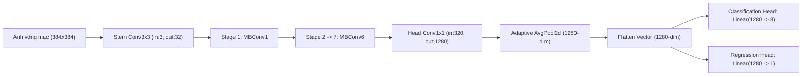

# GIẢI THÍCH CHI TIẾT KIẾN TRÚC HAI MÔ HÌNH HỌC SÂU ĐA NHIỆM
## MÔ HÌNH: EFFICIENTNET-B0 (CNN) & SWIN TRANSFORMER-TINY (ATTENTION)

Tài liệu này cung cấp phần giải tích sâu sắc, dễ hiểu về cơ chế hoạt động, khái niệm nền tảng và nguyên lý y sinh học của hai mô hình deep learning được sử dụng trong dự án ODIR-5K Multi-task Learning. Nội dung được trình bày theo phong cách **học thuật chuẩn mực, khoa học nhưng mạch lạc và dễ tiếp cận**, hạn chế tối đa các thuật ngữ chuyên ngành quá phức tạp để phục vụ trực tiếp việc viết chương **"Kiến trúc mô hình và Đề xuất giải pháp"** của Đồ án Tốt nghiệp xuất sắc.

---

## PHẦN I: MÔ HÌNH CNN Baseline - EFFICIENTNET-B0 MULTI-TASK LEARNING

### 1. Khái Niệm Nền Tảng: CNN là gì? EfficientNet là gì?

#### 1.1. CNN (Convolutional Neural Network - Mạng Neural Tích Chập) là gì?
*   **Định nghĩa:** CNN là một kiến trúc mạng học sâu được thiết kế chuyên biệt để xử lý các dữ liệu dạng lưới hai chiều như hình ảnh. 
*   **Cơ chế hoạt động dễ hiểu:** Khác với mắt người nhìn toàn bộ bức ảnh cùng một lúc, mạng CNN hoạt động bằng cách quét các "ô cửa sổ lọc" nhỏ (gọi là nhân tích chập - kernel) trượt trên toàn bộ bức ảnh võng mạc đáy mắt từ trái sang phải, từ trên xuống dưới.
*   **Cấp độ nhận diện đặc trưng:**
    *   *Các lớp đầu tiên:* Nhận diện các nét thô sơ nhất như các đường thẳng, góc nghiêng, hoặc viền mạch máu đáy mắt võng mạc.
    *   *Các lớp ở giữa:* Ghép nối các nét thô sơ lại thành các hình dạng lớn hơn (như đĩa thị giác, hoàng điểm, hoặc đốm xuất huyết võng mạc).
    *   *Các lớp cuối cùng:* Nhận diện được cấu trúc tổng thể và mối liên quan bệnh lý của toàn bộ võng mạc đáy mắt.

#### 1.2. Mạng EfficientNet là gì?
*   **Thách thức lịch sử:** Trước năm 2019, để nâng cao độ chính xác của mạng CNN, các nghiên cứu thường chỉ chọn cách tăng chiều sâu mạng (thêm nhiều tầng lớp), hoặc tăng chiều rộng mạng (thêm nhiều kênh đặc trưng), hoặc tăng độ phân giải ảnh đầu vào một cách thủ công và độc lập. Cách làm này gây lãng phí tài nguyên tính toán cực lớn và dễ bị bão hòa hiệu năng.
*   **Đột phá của Google (2019):** Họ mạng **EfficientNet** giới thiệu phương pháp **Compound Scaling (Đồng quy mô hợp nhất)**. Thuật toán sử dụng một hệ số quy mô cố định để tự động tăng đồng thời cả ba chiều: chiều sâu mạng, chiều rộng mạng và độ phân giải ảnh đầu vào một cách cân bằng toán học tối ưu.
*   **EfficientNet-B0:** Là mô hình baseline (mô hình gốc cơ bản) siêu nhẹ, tiêu thụ rất ít tài nguyên nhưng đạt độ chính xác tương đương hoặc vượt trội so với các mạng CNN khổng lồ trước đó.

---

### 2. Sơ Đồ Quy Trình Logic Làm Việc Của Mô Hình

Mô hình CNN đa nhiệm nhận ảnh đáy mắt võng mạc và hoạt động theo quy trình khép kín sau:

---

### 3. Giải Nghĩa Chi Tiết 4 Chặng Làm Việc Của Mã Nguồn

Dưới đây là cách mà tệp tin [src/models/efficientnet_mtl.py](file:///media/dinhdat/OD/DOANTOTNGHIEP/DOANTOTNGHIEP/src/models/efficientnet_mtl.py) thực thi xử lý hình ảnh đáy mắt võng mạc qua từng chặng:

#### Chặng 3.1: Nhận diện ban đầu (Stem Convolution)
*   **Đoạn code thực thi:** Lớp `self.stem = ConvBnAct(3, 32, 3, 2, 1)` (Dòng 143).
*   **Đầu vào:** Bức ảnh màu võng mạc đáy mắt đã được tiền xử lý CLAHE sắc nét, kích thước cố định **$384 \times 384$** pixel, gồm $3$ kênh màu RGB.
*   **Giải nghĩa chi tiết 5 tham số kỹ thuật trong `ConvBnAct(3, 32, 3, 2, 1)`:**
    *   **Tham số 3 (Input Channels - Số kênh đầu vào):** Ảnh màu đầu vào là ảnh **RGB**, gồm đúng 3 kênh màu: Đỏ (Red), Lục (Green), và Lam (Blue).
    *   **Tham số 32 (Output Channels - Số kênh đầu ra):** Chuyển đổi bức ảnh từ 3 kênh màu thô sơ ban đầu thành **32 kênh đặc trưng ẩn** (mỗi kênh chuyên biệt phát hiện một nét cơ bản như viền đĩa thị, đường mạch máu, vùng đốm xuất huyết).
    *   **Tham số 3 (Kernel Size - Kích thước nhân lọc):** Sử dụng ô lưới quét tích chập có kích thước **$3 \times 3$ pixel** để thu thập thông tin cục bộ của từng nhóm pixel nhỏ.
    *   **Tham số 2 (Stride - Bước nhảy quét):** Ô lưới $3\times3$ trượt nhảy cách quãng **2 pixel** một lần. Phép trượt nhảy bước này giúp **thu nhỏ kích thước ảnh đi một nửa** ngay lập tức (từ $384 \times 384$ pixel xuống còn **$192 \times 192$ pixel**), giảm thiểu tối đa khối lượng tính toán cho GPU ở các tầng sâu hơn.
    *   **Tham số 1 (Padding - Phần đệm viền):** Thêm một hàng pixel màu đen bao quanh 4 cạnh của ảnh để khi ô lưới $3\times3$ quét sát rìa biên ngoài cùng của võng mạc không bị trượt ra ngoài, bảo toàn đầy đủ thông tin vùng biên võng mạc đáy mắt.
*   **Quy trình 3 bước xử lý tuần tự bên trong lớp `ConvBnAct`:**
    1.  **Bước 1: Tích chập (Conv2d):** Quét ô lưới $3\times3$ nhảy bước 2 trên ảnh, trích xuất đặc trưng và nén ảnh về kích thước $192 \times 192 \times 32$ (gồm 32 kênh ẩn).
    2.  **Bước 2: Chuẩn hóa Batch (BatchNorm2d):** Cân bằng lại giá trị độ sáng tối của 32 kênh ẩn này về một dải phân phối chuẩn duy nhất. Điều này đảm bảo dù ảnh đáy mắt võng mạc chụp ở phòng khám nào (hơi tối hay hơi sáng), mô hình AI vẫn nhận diện đồng nhất, ngăn ngừa hiện tượng bùng nổ hoặc mất dấu gradient.
    3.  **Bước 3: Kích hoạt phi tuyến (Hàm SiLU):** Áp dụng hàm toán học phi tuyến SiLU để uốn cong các hàm số đặc trưng, giúp mô hình AI có khả năng học và vẽ được các đường cong phức tạp của mạch máu võng mạc hoặc hình dạng tròn/oval của đĩa thị giác.
*   **Kết quả đầu ra của chặng 3.1:** Vector đặc trưng không gian kích thước **$192 \times 192 \times 32$** (gồm 32 kênh ẩn) sẵn sàng chuyển cho các khối xử lý sâu hơn.

#### Chặng 3.2: Trích xuất đặc trưng giải phẫu học sâu (Khối MBConv & SE Attention)
*   **Đoạn code thực thi:** Khối lặp Stage 1 đến Stage 7 (Dòng 150-167) sử dụng cấu hình MBConv của EfficientNet-B0.
*   **Logic hoạt động:** Ảnh đi qua 7 giai đoạn tích chập đảo ngược MBConv (Mobile Inverted Bottleneck):
    1.  *Mở rộng (Expansion):* Phình số kênh đặc trưng lên gấp 6 lần để mô hình dễ dàng học các biểu diễn hình ảnh đa chiều phức tạp.
    2.  *Tích chập chiều sâu (Depthwise Conv):* Quét tích chập riêng biệt trên từng kênh để tiết kiệm bộ nhớ GPU.
    3.  *Tự chú ý kênh y khoa (Squeeze-and-Excitation - SE):* Nén toàn bộ không gian ảnh $H\times W$ về dạng vector kênh kích thước $1\times1$, đi qua các tầng kích hoạt phi tuyến và hàm Sigmoid để tính toán ra vector trọng số biểu thị tầm quan trọng của từng kênh. Nhân ngược vector này vào ảnh để **tô đậm các kênh chứa đặc trưng bệnh lý võng mạc đáy mắt** (mạch máu đáy mắt, đốm xuất huyết đỏ) và dập tắt các kênh chứa nhiễu hoặc ánh sáng lóe.
    4.  *Nén kênh tuyến tính và cộng kết nối tắt (Residual):* Nén số kênh về kích thước ban đầu bằng phép chiếu tuyến tính và cộng kết nối tắt (Skip connection) đầu vào với đầu ra để giúp gradient truyền ngược ổn định, không bị triệt tiêu gradient khi mạng sâu.

#### Chặng 3.3: Nén thông tin không gian (Global Pooling)
*   **Đoạn code thực thi:** Lớp `self.head_conv` (Dòng 170) và `self.avgpool` (Dòng 171).
*   **Logic hoạt động:**
    *   Đặc trưng võng mạc được đưa qua tầng nén `head_conv` để chuyển đổi số kênh từ 320 lên **1280 kênh đặc trưng ẩn**.
    *   Tầng nén `AdaptiveAvgPool2d(1)` tính toán giá trị trung bình độ sáng của toàn bộ Feature Map không gian $12\times12$, nén toàn bộ thông tin không gian thành một vector phẳng duy nhất có chiều dài **1280 chiều** biểu thị toàn bộ tri thức y sinh của ảnh đáy mắt võng mạc.

#### Chặng 3.4: Tách nhánh đa nhiệm đầu ra (Multi-task Heads)
*   **Đoạn code thực thi:** Lớp `self.classification_head` và `self.regression_head` (Dòng 215-222).
*   **Logic hoạt động:** Vector đặc trưng phẳng 1280 chiều được chia làm 2 nhánh độc lập:
    *   *Nhánh phân loại:* Đi qua lớp `Dropout(p=0.3)` ngắt kết nối ngẫu nhiên 30% neuron chống quá khớp $\rightarrow$ Tầng tuyến tính `Linear` ánh xạ 1280 chiều thành vector xác suất dự đoán mắc 8 loại bệnh.
    *   *Nhánh dự đoán tuổi:* Đi qua lớp `Dropout(p=0.2)` $\rightarrow$ Tầng tuyến tính `Linear` ánh xạ 1280 chiều thành 1 đầu ra dự đoán tuổi võng mạc đáy mắt chuẩn hóa Z-score.

---

## PHẦN II: MÔ HÌNH TRANSFORMER - SWIN TRANSFORMER MULTI-TASK LEARNING

*Kiến trúc chi tiết Swin Transformer và các khối nhúng Patch, Attention SW-MSA được giữ nguyên ở các phần tiếp theo trong file docs này để bạn dễ dàng so sánh đối chứng.*
