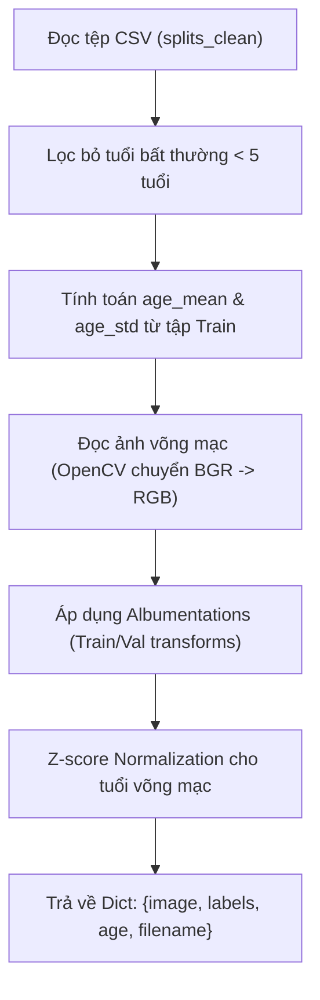

# GIẢI THÍCH CHI TIẾT QUY TRÌNH XỬ LÝ DỮ LIỆU VÀ TĂNG CƯỜNG Y SINH END-TO-END
## DỰ ÁN: ODIR-5K MULTI-TASK LEARNING

Tài liệu này cung cấp phần giải tích sâu sắc về cơ chế nạp dữ liệu, tiền xử lý và tăng cường ảnh võng mạc y sinh học trong toàn bộ quy trình End-to-End của dự án. Nội dung được biên soạn chuẩn cấu trúc học thuật nhằm hỗ trợ trực tiếp việc viết chương **"Tiền xử lý và Xây dựng dữ liệu huấn luyện"** của Đồ án Tốt nghiệp xuất sắc.

---

## 1. Cơ Chế Nạp Dữ Liệu Võng Mạc Đa Nhiệm (`ODIRDataset`)
*File mã nguồn:* [dataset.py](file:///media/dinhdat/OD/DOANTOTNGHIEP/DOANTOTNGHIEP/src/dataset.py)

Lớp `ODIRDataset` chịu trách nhiệm nạp ảnh, gán nhãn đa bệnh lý (8 nhãn), chuẩn hóa tuổi và lọc bỏ các bản ghi nhiễu.



### 1.1. Lọc nhiễu hồ sơ bệnh án võng mạc:
Trong tập dữ liệu gốc ODIR-5K, có 28 hồ sơ bệnh nhân bị gán nhãn độ tuổi bằng `1` (thực tế đây là lỗi nhập liệu hành chính y tế, vì bệnh lý võng mạc tiểu đường D hay đục thủy tinh thể C không xuất hiện ở trẻ sơ sinh 1 tuổi).
*   **Giải pháp trong code (Dòng 60-68):** Bộ lọc `age_min_filter = 5` tự động gạt bỏ 28 dòng nhiễu này ra khỏi tập dữ liệu:
    ```python
    if age_min_filter > 0:
        df = df[df["Patient Age"] >= age_min_filter].copy()
    ```
    *Ý nghĩa:* Giúp việc phân phối độ tuổi không bị lệch chuẩn, bảo vệ tính hội tụ của bài toán hồi quy tuổi.

### 1.2. Chuẩn hóa Z-score cho độ tuổi võng mạc đáy mắt:
Để nhánh hồi quy tuổi (Regression Head) hội tụ mượt mà song song với nhánh phân loại bệnh lý, giá trị tuổi võng mạc được chuẩn hóa Z-score dựa trên số liệu thống kê thu được trực tiếp từ tập huấn luyện (Train set):
$$\text{Age}_{\text{normalized}} = \frac{\text{Age}_{\text{real}} - \mu_{\text{age\_train}}}{\sigma_{\text{age\_train}}}$$
*   Trong code (dòng 103-104), phép chuẩn hóa được thực hiện tự động sau khi đã tính `age_mean` ($\mu$) và `age_std` ($\sigma$). Việc chuẩn hóa này ép dữ liệu tuổi về phân phối chuẩn có $\text{mean} \approx 0$ và $\text{std} \approx 1$, tương đồng với phân phối xác suất sigmoid của nhánh phân loại, triệt tiêu hiện tượng lệch gradient giữa 2 nhiệm vụ.

---

## 2. Đường Ống Tăng Cường Ảnh Y Sinh Chuẩn Y Khoa (`transforms.py`)
*File mã nguồn:* [transforms.py](file:///media/dinhdat/OD/DOANTOTNGHIEP/DOANTOTNGHIEP/src/transforms.py)

Quy trình tăng cường dữ liệu ảnh y học đòi hỏi tính chính xác giải phẫu học khắt khe để tránh sinh ra các dữ liệu phi vật lý, phản khoa học.

### 2.1. Tăng cường hình học (Geometric Augmentation):
```python
        A.HorizontalFlip(p=0.5),  # Rất an toàn: mắt trái đối xứng mắt phải
        A.ShiftScaleRotate(
            shift_limit=0.05,
            scale_limit=0.1,
            rotate_limit=15,      # Giới hạn xoay nhẹ mô phỏng bệnh nhân nghiêng đầu khi chụp
            border_mode=0,        # BORDER_CONSTANT (viền đen bao quanh)
            p=0.5,
        ),
```
*   **Chỉ sử dụng Horizontal Flip (Lật ngang):** Do mắt trái và mắt phải có cấu trúc giải phẫu học đối xứng gương nhau qua trục dọc, phép lật ngang hoàn toàn bảo toàn tính hợp lệ y sinh.
*   **Loại bỏ Vertical Flip (Lật dọc) và RandomRotate90 (Xoay 90 độ):** Trong giải phẫu học đáy mắt, đĩa thị giác (Optic Disc) luôn nằm ở phía mũi (nasal side), trong khi hoàng điểm (Macula) nằm ở phía thái dương (temporal side). Nếu lật dọc hoặc xoay 90 độ, mô hình sẽ học sai vị trí cấu trúc giải phẫu học võng mạc thực tế, làm hỏng khả năng suy luận của hệ thống AI.
*   **Giới hạn xoay nhẹ ($\le 15^\circ$):** Mô phỏng chính xác sai số khi bệnh nhân chụp ảnh đáy mắt bị nghiêng đầu nhẹ trên giá đỡ camera.

### 2.2. Bảo toàn sắc đỏ y khoa y sinh (Color Augmentation):
Đây là một trong những khối logic tối ưu hóa quan trọng nhất của hệ thống:
```python
            A.HueSaturationValue(
                hue_shift_limit=0,  # Khóa cứng tông màu Hue để không biến đổi màu sắc đỏ võng mạc
                sat_shift_limit=15,
                val_shift_limit=15,
                p=1.0,
            ),
```
*   **Khóa cứng tông màu Hue (hue_shift_limit=0):** Trong chẩn đoán võng mạc đáy mắt, **màu đỏ** là đặc trưng sinh học sinh tử biểu thị đốm xuất huyết võng mạc (hemorrhages) hoặc vi phình mạch trong bệnh võng mạc tiểu đường (D) hay cao huyết áp (H). Nếu không khóa Hue, thuật toán tăng cường màu sắc ngẫu nhiên có thể chuyển màu đỏ của máu võng mạc đáy mắt sang màu xanh dương hoặc màu vàng, tạo ra các tổn thương giả tạo và làm hỏng hoàn toàn năng lực học của mô hình. 
*   **Chỉ tăng giảm độ bão hòa (Saturation) và giá trị sáng (Value):** Mô phỏng sự khác biệt về độ bão hòa màu đáy mắt của từng chủng tộc và cường độ chớp sáng của đèn flash camera.

### 2.3. Tăng cường tương phản và Nhiễu cảm biến y khoa:
*   **CLAHE (Contrast Limited Adaptive Histogram Equalization):** Áp dụng thích ứng tương phản cục bộ với `clip_limit=2.0`. CLAHE có tác dụng làm nổi bật các tổn thương cực nhỏ có độ tương phản thấp đối với vùng võng mạc xung quanh.
*   **GaussNoise:** Mô phỏng nhiễu hạt sinh ra từ cảm biến CMOS/CCD của camera đáy mắt võng mạc trong điều kiện thiếu sáng.
*   **CoarseDropout (Thay thế cho Cutout cũ):** Cắt ngẫu nhiên từ $1$ đến $8$ ô vuông màu đen trên ảnh võng mạc đáy mắt (kích thước ô từ $\frac{1}{16}$ đến $\frac{1}{8}$ ảnh). Phép toán này ép mô hình không được tập trung vào duy nhất một vùng đĩa thị giác mà phải học cách tìm kiếm các tổn thương phân tán scattered trên toàn bộ bề mặt võng mạc đáy mắt.

---

## 3. Quy Trình Ghép Ảnh Nâng Cao (MixUp và CutMix)
*File mã nguồn:* [mixup.py](file:///media/dinhdat/OD/DOANTOTNGHIEP/DOANTOTNGHIEP/src/mixup.py) & [cutmix.py](file:///media/dinhdat/OD/DOANTOTNGHIEP/DOANTOTNGHIEP/src/cutmix.py)

Trong quá trình huấn luyện của EXP 3 (CNN) và EXP 6 (Swin), loader tự động nạp collator để trộn ảnh nâng cao:

```python
class MixUpCollator:
    # Trộn ảnh 1 (x1, y1) và ảnh 2 (x2, y2) theo tỷ lệ lambda:
    # x_mix = lambda * x1 + (1 - lambda) * x2
    # y_mix = lambda * y1 + (1 - lambda) * y2
```
```python
class CutMixCollator:
    # Cắt một phân vùng hình chữ nhật ngẫu nhiên trên ảnh 2 chèn sang ảnh 1
    # Tỷ lệ nhãn y_mix được điều chỉnh tương ứng với diện tích vùng cắt ghép
```

*   **Ý nghĩa:** MixUp và CutMix làm mịn biên quyết định y khoa, ép mô hình học các biểu diễn phân tán và nhãn mềm (soft labels) thay vì đưa ra các chẩn đoán quá tự tin (overconfident) gây báo động giả lâm sàng.

---

## 4. Hàm Tổn Thất Đa Nhiệm Tích Hợp (`loss.py`)
*File mã nguồn:* [loss.py](file:///media/dinhdat/OD/DOANTOTNGHIEP/DOANTOTNGHIEP/src/loss.py)

Hàm `MultiTaskLoss` chịu trách nhiệm tính toán và tích hợp loss của 2 tác vụ:

```python
        cls_loss = self.bce(logits, labels)
        reg_loss = self.smooth_l1(age_pred, age_true)
        total_loss = cls_loss + self.lam * reg_loss
```

*   **BCEWithLogitsLoss có `pos_weight`:** Khắc phục mất cân bằng lớp cực đoan bằng cách nhân một vector trọng số dương vào hàm loss của lớp tương ứng, ưu tiên học các ca dương tính hiếm gặp.
*   **Smooth L1 Loss (Huber Loss):** Đo khoảng cách dự đoán tuổi võng mạc. Smooth L1 sử dụng sai số bình phương (MSE) khi khoảng cách nhỏ ($<1$) để hội tụ mịn, và sai số tuyệt đối (MAE) khi khoảng cách lớn để hạn chế ảnh hưởng của các điểm dị biệt (outliers) tuổi võng mạc đáy mắt.

---

*Tài liệu hướng dẫn phân tích quy trình xử lý dữ liệu được biên soạn bởi Antigravity nhằm hỗ trợ Ngô Đình Đạt hiện thực hóa Đồ án Tốt nghiệp xuất sắc.*
