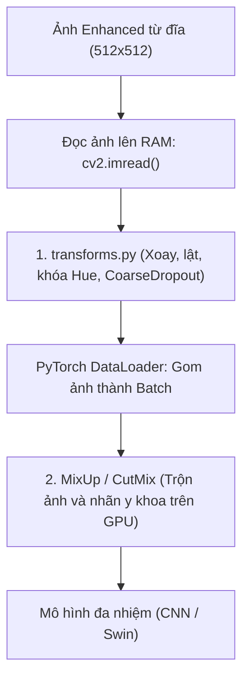

# HƯỚNG DẪN GIẢI THÍCH CHI TIẾT GIAI ĐOẠN 2 — TĂNG CƯỜNG DỮ LIỆU ĐỘNG (DATA AUGMENTATION)
## DỰ ÁN: ODIR-5K MULTI-TASK LEARNING

Tài liệu này giải thích chi tiết cấu trúc thuật toán, vai trò của từng dòng code và nguyên lý y sinh học của **Giai đoạn 2: Tăng cường dữ liệu động (Online Data Augmentation)**, bao gồm tệp tin đường ống Albumentations (`src/transforms.py`), thuật toán trộn ảnh toàn cục (`src/mixup.py`), và thuật toán cắt dán tổn thương cục bộ (`src/cutmix.py`). Nội dung được biên soạn chuẩn cấu trúc học thuật nhằm hỗ trợ trực tiếp việc viết chương **"Tiền xử lý và Xây dựng dữ liệu huấn luyện"** của Đồ án Tốt nghiệp xuất sắc.

---

## 1. Bản Chất Của Tăng Cường Dữ Liệu Động (Online Augmentation)

Khác với Giai đoạn 1 (Tiền xử lý tĩnh được lưu cứng trên đĩa), Giai đoạn 2 diễn ra hoàn toàn trên **bộ nhớ RAM của CPU/GPU trong thời gian thực (Real-time)** khi quá trình huấn luyện bắt đầu. 



*   **Tại sao không lưu kết quả lên đĩa?** 
    1.  *Bảo toàn tính ngẫu nhiên vô hạn:* Mỗi epoch mô hình sẽ nhìn thấy một biến thể ảnh võng mạc đáy mắt khác nhau (Ví dụ: epoch 1 xoay $+5^\circ$, epoch 2 lật ngang, epoch 3 áp dụng ô cắt đen). Nếu lưu cứng lên đĩa, tính ngẫu nhiên này sẽ bị mất, gây ra quá khớp (overfitting).
    2.  *Tránh tràn bộ nhớ đĩa:* 5,600 ảnh nhân với 45 epochs sẽ tạo ra hơn **250,000 ảnh**, tốn khoảng **25GB - 50GB** ổ đĩa. Việc chạy động trên RAM giúp tiết kiệm đĩa cứng và đẩy nhanh tốc độ truyền dữ liệu.

---

## 2. Giải Nghĩa Chi Tiết Mã Nguồn `src/transforms.py`
*Đường dẫn tệp:* [src/transforms.py](file:///media/dinhdat/OD/DOANTOTNGHIEP/DOANTOTNGHIEP/src/transforms.py)

Tệp tin này sử dụng thư viện hiệu năng cao **Albumentations** để định nghĩa đường ống biến đổi hình ảnh đáy mắt võng mạc y sinh.

```python
def get_train_transforms(img_size: int = 224) -> A.Compose:
    return A.Compose([
        A.Resize(height=img_size, width=img_size),
```

### 2.1. Phép lật ảnh đối xứng gương y khoa:
```python
        A.HorizontalFlip(p=0.5),  # Rất an toàn: mắt trái đối xứng mắt phải
```
*   **Giải nghĩa:** Cho phép lật ảnh theo chiều ngang với xác suất $50\%$. Trong giải phẫu học, mắt trái và mắt phải đối xứng gương gương nhau qua trục dọc, do đó phép lật ngang hoàn toàn bảo toàn tính hợp lệ y sinh.
*   *Lưu ý quan trọng:* Tuyệt đối loại bỏ phép lật dọc (`VerticalFlip`) và xoay 90 độ vì đĩa thị giác (Optic Disc) luôn nằm phía mũi và hoàng điểm (Macula) nằm phía thái dương. Nếu lật dọc hoặc xoay ngang, cấu trúc giải phẫu học võng mạc sẽ bị đảo lộn phi vật lý, làm hỏng khả năng suy luận của mô hình.

### 2.2. Phép dịch chuyển và xoay nhẹ:
```python
        A.ShiftScaleRotate(
            shift_limit=0.05,
            scale_limit=0.1,
            rotate_limit=15,      # Giới hạn xoay nhẹ mô phỏng bệnh nhân nghiêng đầu khi chụp
            border_mode=0,        # BORDER_CONSTANT (viền đen bao quanh)
            p=0.5,
        ),
```
*   **Giải nghĩa:** Chỉ cho phép xoay nhẹ trong dải từ $-15^\circ$ đến $+15^\circ$ để mô phỏng chính xác sai số khi bệnh nhân bị nghiêng đầu nhẹ trên giá đỡ cằm của máy chụp đáy mắt. Thiết lập `border_mode=0` để lấp đầy vùng trống sau khi xoay bằng màu đen (đồng bộ viền đen tự nhiên).

### 2.3. Khóa màu Hue bảo toàn sắc đỏ của máu võng mạc đáy mắt:
```python
            A.HueSaturationValue(
                hue_shift_limit=0,  # Khóa cứng tông màu Hue để không biến đổi màu đỏ của máu võng mạc
                sat_shift_limit=15,
                val_shift_limit=15,
                p=1.0,
            ),
```
*   **Giải nghĩa:** Thiết lập **`hue_shift_limit=0`** để khóa cứng tông màu sắc. Màu đỏ là đặc trưng sinh học sinh tử biểu thị đốm xuất huyết võng mạc (hemorrhages) hoặc vi phình mạch. Nếu không khóa Hue, thuật toán tăng cường màu sắc ngẫu nhiên sẽ đổi màu đỏ của máu võng mạc đáy mắt thành màu xanh dương hoặc vàng, làm hỏng hoàn toàn năng lực học của mô hình. Chúng ta chỉ cho phép thay đổi Saturation (độ bão hòa màu) và Value (độ sáng tối) để mô phỏng cường độ flash.

### 2.4. Tăng tương phản cục bộ và Che khuất điều hòa:
```python
        A.CLAHE(clip_limit=2.0, tile_grid_size=(8, 8), p=0.4),
        A.GaussNoise(std_range=(0.02, 0.1), p=0.2),
        A.GaussianBlur(blur_limit=(3, 5), p=0.2),
        A.CoarseDropout(
            num_holes_range=(1, 8),
            hole_height_range=(img_size // 16, img_size // 8),
            fill=0,
            p=0.3,
        ),
```
*   **CLAHE:** Tăng tương phản cục bộ thích ứng để làm nổi bật tổn thương.
*   **GaussNoise & GaussianBlur:** Mô phỏng nhiễu hạt cảm biến CMOS/CCD và hiện tượng mờ ảnh võng mạc do đục thủy tinh thể hoặc lỗi lấy nét kính soi đáy mắt.
*   **CoarseDropout:** Cắt ngẫu nhiên từ $1$ đến $8$ ô đen nhỏ trên ảnh võng mạc, ép mô hình không được tập trung vào duy nhất một vùng đĩa thị giác mà bắt buộc phải học cách tìm kiếm đặc trưng bệnh học phân tán scattered trên toàn bộ đáy mắt võng mạc.

---

## 3. Giải Nghĩa Chi Tiết Thuật Toán Trộn Ảnh Toàn Cục MixUp (`src/mixup.py`)
*Đường dẫn tệp:* [src/mixup.py](file:///media/dinhdat/OD/DOANTOTNGHIEP/DOANTOTNGHIEP/src/mixup.py)

### 3.1. Nguyên lý toán học:
MixUp được thiết kế để giải quyết bài toán quá khớp của mô hình khi học trên các điểm dữ liệu tĩnh (Empirical Risk Minimization). Kỹ thuật này bắt mô hình phải học trên các điểm nội suy tuyến tính giữa hai ảnh ngẫu nhiên (Vicinal Risk Minimization).

### 2.2. Giải nghĩa code chi tiết:
KhiDataLoader gom đủ 16 ảnh, bộ trộn `MixUpCollator` thực hiện phép toán:
1.  Rút ngẫu nhiên hệ số trộn $\lambda \in [0, 1]$ từ phân phối Beta có tham số $\alpha = 0.4$:
    $$\lambda \sim \text{Beta}(0.4, 0.4)$$
2.  Bảo đảm ảnh chính luôn chiếm tỷ trọng lớn hơn $50\%$ để tránh mất nhãn gốc:
    $$\lambda = \max(\lambda, 1 - \lambda)$$
3.  Thực hiện phép nội suy tuyến tính để trộn ảnh, trộn vector nhãn đa lớp và trộn giá trị tuổi:
    ```python
    image_mix  = lam * image_A  + (1 - lam) * image_B
    labels_mix = lam * labels_A + (1 - lam) * labels_B
    age_mix    = lam * age_A    + (1 - lam) * age_B
    ```
*   *Ý nghĩa y sinh:* Tạo ra các nhãn mềm (soft-labels). Ví dụ, nếu trộn ảnh A (bị Glaucoma nhãn `[0,0,1,0,0,0,0,0]`) với ảnh B (Bình thường nhãn `[1,0,0,0,0,0,0,0]`) theo tỷ lệ $\lambda = 0.7$, nhãn mới sẽ là `[0.3, 0, 0.7, 0, 0, 0, 0, 0]`. Mô hình học cách suy luận ranh giới quyết định y khoa mềm mại hơn, ít bị quá khớp vào các nhãn đa số chiếm ưu thế.

---

## 4. Giải Nghĩa Chi Tiết Thuật Toán Cắt Dán Tổn Thương CutMix (`src/cutmix.py`)
*Đường dẫn tệp:* [src/cutmix.py](file:///media/dinhdat/OD/DOANTOTNGHIEP/DOANTOTNGHIEP/src/cutmix.py)

### 4.1. Nguyên lý toán học:
Trộn toàn bộ pixel của MixUp dễ làm nhòa đi cấu trúc không gian cục bộ y sinh của mạch máu võng mạc đáy mắt. **CutMix** giải quyết vấn đề này bằng cách **cắt một phân vùng hình chữ nhật** trên ảnh B và dán đè lên ảnh A.

### 4.2. Giải nghĩa code chi tiết:
1.  Rút ngẫu nhiên hệ số $\lambda_0$ từ phân phối Beta có tham số $\alpha = 1.0$ (Phân phối đều):
    $$\lambda_0 \sim \text{Beta}(1.0, 1.0)$$
2.  Xác định kích thước vùng cắt (Width và Height) tỷ lệ thuận với tỷ trọng $(1 - \lambda_0)$:
    $$W_{\text{cut}} = W \times \sqrt{1 - \lambda_0}, \quad H_{\text{cut}} = H \times \sqrt{1 - \lambda_0}$$
3.  Chọn ngẫu nhiên tọa độ tâm $(c_x, c_y)$ của vùng cắt nằm bên trong ảnh.
4.  Dán đè vùng cắt từ ảnh B sang ảnh A:
    ```python
    image_mix[:, y1:y2, x1:x2] = image_B[:, y1:y2, x1:x2]
    ```
5.  Tính toán lại hệ số $\lambda$ thực tế dựa trên tỷ lệ diện tích vùng cắt ghép thực tế trên GPU:
    $$\lambda = 1 - \frac{(x_2 - x_1) \cdot (y_2 - y_1)}{\text{Width} \times \text{Height}}$$
6.  Trộn nhãn đa lớp và độ tuổi võng mạc đáy mắt theo hệ số $\lambda$ thực tế vừa tính:
    ```python
    labels_mix = lam * labels_A + (1 - lam) * labels_B
    age_mix    = lam * age_A    + (1 - lam) * age_B
    ```

*   *Ý nghĩa y sinh:* CutMix giữ nguyên vẹn 100% các đường mạch máu đáy mắt và tổn thương y sinh ở vùng không bị cắt. Nó ép mô hình CNN/Transformer phải học cách nhận diện đặc trưng cục bộ (Localizable Features) và vị trí của các tổn thương võng mạc đáy mắt thay vì nhìn lướt qua toàn bộ bức ảnh võng mạc.

---

*Tài liệu hướng dẫn giải thích Giai đoạn 2 Tăng cường dữ liệu động được biên soạn bởi Antigravity nhằm hỗ trợ Ngô Đình Đạt hiện thực hóa Đồ án Tốt nghiệp xuất sắc.*
