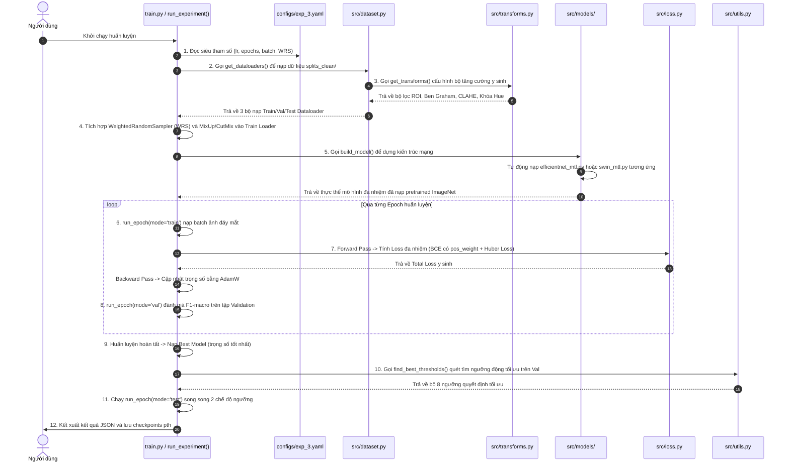

# TÀI LIỆU HƯỚNG DẪN CHI TIẾT MÃ NGUỒN VÀ LUỒNG CHẠY END-TO-END DỰ ÁN
## DỰ ÁN: ODIR-5K MULTI-TASK LEARNING (PHÂN LOẠI BỆNH LÝ & DỰ ĐOÁN TUỔI VÕNG MẠC)

Tài liệu này được biên soạn để cung cấp cái nhìn trực quan nhất về **luồng chạy dữ liệu từ đầu đến cuối (End-to-End Flow)** giữa các tệp tin trong dự án, đồng thời giải nghĩa chi tiết mã nguồn của từng tệp tin. Nội dung được trình bày chuẩn khoa học giúp bạn tự tin viết chương **"Thiết kế hệ thống, Hiện thực hóa giải thuật và Đánh giá thực nghiệm"** của Đồ án Tốt nghiệp xuất sắc.

---

## PHẦN I: BỨC TRANH TỔNG THỂ — LUỒNG CHẠY END-TO-END GIỮA CÁC TỆP TIN

Khi bạn nhấn nút chạy notebook trên Kaggle (hoặc gõ lệnh chạy `train.py` cục bộ), hệ thống sẽ kích hoạt một chuỗi tương tác khép kín giữa các tệp tin theo sơ đồ sau:



---

## PHẦN II: GIẢI NGHĨA CHI TIẾT MÃ NGUỒN TỪNG FILE TRONG HỆ THỐNG

Dưới đây là phần giải thích chi tiết cấu trúc, vai trò và giải nghĩa từng dòng code quan trọng của từng tệp tin trong dự án của bạn:

---

### TỆP 1: `src/transforms.py` (Đường ống tăng cường ảnh võng mạc y sinh)
*Đường dẫn tệp:* [src/transforms.py](file:///media/dinhdat/OD/DOANTOTNGHIEP/DOANTOTNGHIEP/src/transforms.py)

#### 1. Vai trò trong luồng chạy:
Tệp này được gọi bởi `src/dataset.py` (Bước 3 trong sơ đồ). Nhiệm vụ của nó là định nghĩa cách biến đổi hình học và màu sắc của ảnh đáy mắt võng mạc thô để tạo ra dữ liệu huấn luyện đa dạng, sạch nhiễu và bảo toàn cấu trúc giải phẫu học võng mạc đáy mắt.

#### 2. Phân tích các khối code cốt lõi:
*   **Bảo toàn giải phẫu học võng mạc:**
    ```python
    A.HorizontalFlip(p=0.5),  # Rất an toàn: mắt trái đối xứng mắt phải
    ```
    *Giải nghĩa:* Chỉ sử dụng phép lật ngang (Horizontal Flip) vì mắt trái và mắt phải có cấu trúc giải phẫu học đối xứng gương qua trục dọc. Tuyệt đối loại bỏ lật dọc (Vertical Flip) và xoay 90 độ vì nó sẽ đảo lộn vị trí tự nhiên của đĩa thị giác (Optic Disc) và hoàng điểm (Macula), sinh ra dữ liệu phi vật lý làm hỏng mô hình.
*   **Giới hạn góc xoay đầu của bệnh nhân:**
    ```python
    A.ShiftScaleRotate(shift_limit=0.05, scale_limit=0.1, rotate_limit=15, border_mode=0, p=0.5)
    ```
    *Giải nghĩa:* Khống chế góc xoay tối đa là $15^\circ$ để mô phỏng chính xác sai số thực tế khi bệnh nhân chụp ảnh đáy mắt bị nghiêng đầu nhẹ trên giá đỡ camera. Thiết lập `border_mode=0` để các vùng trống sau khi xoay được lấp đầy bằng màu đen (đồng bộ với viền đen tự nhiên của ảnh võng mạc).
*   **Khóa Hue để bảo toàn sắc đỏ y sinh (CỰC KỲ QUAN TRỌNG):**
    ```python
    A.HueSaturationValue(hue_shift_limit=0, sat_shift_limit=15, val_shift_limit=15, p=1.0)
    ```
    *Giải nghĩa:* Thiết lập **`hue_shift_limit=0`** để khóa cứng tông màu Hue (màu sắc). Trong chẩn đoán võng mạc đáy mắt, màu đỏ là đặc trưng sinh học sinh tử biểu thị đốm xuất huyết võng mạc (hemorrhages) hoặc vi phình mạch. Nếu không khóa Hue, màu đỏ của máu đáy mắt có thể biến thành màu xanh dương hoặc vàng, làm hỏng hoàn toàn năng lực học của mô hình. Chúng ta chỉ cho phép thay đổi Saturation (độ bão hòa màu) và Value (độ sáng tối) để mô phỏng ánh sáng đèn flash camera.
*   **CLAHE và CoarseDropout:**
    ```python
    A.CLAHE(clip_limit=2.0, tile_grid_size=(8, 8), p=0.4)
    A.CoarseDropout(num_holes_range=(1, 8), hole_height_range=(img_size // 16, img_size // 8), fill=0, p=0.3)
    ```
    *Giải nghĩa:* `CLAHE` tăng tương phản cục bộ để làm nổi bật tổn thương. `CoarseDropout` cắt các ô vuông đen ngẫu nhiên trên ảnh đáy mắt võng mạc, ép mô hình không được học vẹt vào một vùng cố định mà bắt buộc phải tìm kiếm các đặc trưng bệnh học phân tán scattered trên toàn bộ bề mặt võng mạc.

---

### TỆP 2: `src/dataset.py` (Định nghĩa Dataset và Trích xuất chỉ số thống kê)
*Đường dẫn tệp:* [src/dataset.py](file:///media/dinhdat/OD/DOANTOTNGHIEP/DOANTOTNGHIEP/src/dataset.py)

#### 1. Vai trò trong luồng chạy:
Tệp này được gọi bởi `train.py` ở đầu tiến trình (Bước 2). Nó thực hiện việc đọc dữ liệu từ file CSV, lọc nhiễu tuổi y tế, chuẩn hóa Z-score cho độ tuổi và đóng gói ảnh đáy mắt võng mạc cùng nhãn thành các PyTorch tensors.

#### 2. Phân tích các khối code cốt lõi:
*   **Lọc bỏ tuổi nhiễu y tế (Dòng 60-68):**
    ```python
    if age_min_filter > 0:
        df = df[df["Patient Age"] >= age_min_filter].copy()
    ```
    *Giải nghĩa:* Tự động loại bỏ các hồ sơ bệnh án có độ tuổi $< 5$ tuổi (thực tế ODIR-5K có 28 hồ sơ bị lỗi hành chính nhập tuổi bằng `1` tuổi, trong khi đục thủy tinh thể hay võng mạc tiểu đường không xuất hiện ở trẻ sơ sinh). Việc loại bỏ này bảo vệ phân phối chuẩn độ tuổi của bài toán hồi quy.
*   **Chuẩn hóa Z-score cho tuổi võng mạc đáy mắt (Dòng 103-104):**
    ```python
    if self.age_mean is not None and self.age_std is not None:
        age = (age - self.age_mean) / self.age_std
    ```
    *Giải nghĩa:* Thực hiện phép chuẩn hóa Z-score dựa trên độ tuổi trung bình ($\mu$) và độ lệch chuẩn ($\sigma$) tính toán trực tiếp từ tập huấn luyện (Train set). Điều này ép dữ liệu tuổi về dải giá trị chuẩn có $\text{mean} \approx 0$ và $\text{std} \approx 1$ tương đồng với xác suất của nhánh phân loại để triệt tiêu hiện tượng lệch gradient giữa 2 nhiệm vụ.
*   **Đầu ra của Dataset (Dòng 107-112):**
    ```python
    return {
        "image": image,       # Tensor ảnh [3, H, W] đã chuẩn hóa ImageNet
        "labels": labels,     # Vector FloatTensor nhãn đa bệnh lý [8]
        "age": age,           # Tensor Float 1 chiều chứa tuổi chuẩn hóa [1]
        "filename": row["filename"]
    }
    ```

---

### TỆP 3: `src/models/efficientnet_mtl.py` (Kiến trúc mô hình CNN Baseline)
*Đường dẫn tệp:* [src/models/efficientnet_mtl.py](file:///media/dinhdat/OD/DOANTOTNGHIEP/DOANTOTNGHIEP/src/models/efficientnet_mtl.py)

#### 1. Vai trò trong luồng chạy:
Tệp này được gọi bởi hàm `build_model()` (Bước 5) để dựng cấu trúc mạng CNN Baseline (EfficientNet-B0) kết hợp hai nhánh đầu ra đa nhiệm.

#### 2. Phân tích các khối code cốt lõi:
*   **Cấu trúc MBConv và SE Attention (Squeeze-and-Excitation):**
    ```python
    class SqueezeExcite(nn.Module):
        def __init__(self, in_ch: int, reduced_ch: int) -> None:
            super().__init__()
            self.se = nn.Sequential(
                nn.AdaptiveAvgPool2d(1),                     # Squeeze: nén không gian HxW về 1x1
                nn.Conv2d(in_ch, reduced_ch, 1, bias=True), # Giảm kênh để học phi tuyến
                nn.SiLU(),
                nn.Conv2d(reduced_ch, in_ch, 1, bias=True),  # Khôi phục số kênh gốc
                nn.Sigmoid(),                                # Excite: tính trọng số kênh trong khoảng [0, 1]
            )
    ```
    *Giải nghĩa:* SE Attention tính toán độ quan trọng của từng kênh đặc trưng. Các kênh chứa thông tin bệnh lý võng mạc đáy mắt nhạy cảm sẽ nhận được trọng số lớn và các kênh chứa nhiễu nền sẽ bị triệt tiêu về 0.
*   **Thiết kế nhánh đa nhiệm (Multi-task Heads):**
    ```python
    self.classification_head = nn.Sequential(
        nn.Dropout(p=dropout_cls),
        nn.Linear(self.FEATURE_DIM, num_labels), # Feature_dim = 1280, num_labels = 8
    )
    self.regression_head = nn.Sequential(
        nn.Dropout(p=dropout_reg),
        nn.Linear(self.FEATURE_DIM, 1),           # Đầu ra liên tục dự đoán tuổi
    )
    ```
    *Giải nghĩa:* Phân tách vector đặc trưng 1280 chiều sau tầng pooling thành hai nhánh độc lập. Lớp `Dropout` đóng vai trò điều hòa, ngẫu nhiên ngắt kết nối các neuron để chống quá khớp (overfitting).

---

### TỆP 4: `src/models/swin_mtl.py` (Kiến trúc mô hình Swin Transformer)
*Đường dẫn tệp:* [src/models/swin_mtl.py](file:///media/dinhdat/OD/DOANTOTNGHIEP/DOANTOTNGHIEP/src/models/swin_mtl.py)

#### 1. Vai trò trong luồng chạy:
Tệp này được gọi bởi hàm `build_model()` để dựng cấu trúc mạng Attention phân cấp (Swin Transformer-Tiny).

#### 2. Phân tích các khối code cốt lõi:
*   **Bản vá nội suy nhúng vị trí y sinh khi đổi kích thước ảnh lên `384x384`:**
    ```python
    if needs_img_size_override:
        backbone = timm.create_model(
            timm_name,
            pretrained=pretrained,
            num_classes=0,
            global_pool="avg",
            img_size=img_size,   # Kích hoạt Relative Position Interpolation trong timm
        )
    ```
    *Giải nghĩa:* Khi thay đổi độ phân giải ảnh từ mặc định `224` lên `384` để giữ nguyên chi tiết tổn thương võng mạc sắc nét, lưới nhúng vị trí tương đối bị lệch. Việc truyền trực tiếp `img_size=img_size` kích hoạt thuật toán nội suy tuyến tính song song của timm giúp tự động co dãn lưới nhúng vị trí ImageNet cũ khớp hoàn hảo với ảnh võng mạc mới, ngăn chặn lỗi crash hệ thống.
*   **Đảm bảo đầu ra Feature 2D cho Multi-task Heads:**
    ```python
    features = self.backbone(x)
    if features.ndim > 2:
        features = features.mean(dim=list(range(2, features.ndim))) # Tương đương Global Average Pooling
    ```

---

### TỆP 5: `src/loss.py` (Hàm loss đa nhiệm tích hợp BCE và Smooth L1)
*Đường dẫn tệp:* [src/loss.py](file:///media/dinhdat/OD/DOANTOTNGHIEP/DOANTOTNGHIEP/src/loss.py)

#### 1. Vai trò trong luồng chạy:
Được gọi bởi `train.py` bên trong vòng lặp epoch chính (Bước 7). Nó chịu trách nhiệm tính toán sai số tổng hợp để thực hiện lan truyền đạo hàm ngược.

#### 2. Phân tích các khối code cốt lõi:
*   **Tính toán loss đa nhiệm kết hợp (Dòng 86-89):**
    ```python
    cls_loss = self.bce(logits, labels)
    reg_loss = self.smooth_l1(age_pred, age_true)
    total_loss = cls_loss + self.lam * reg_loss
    ```
    *Giải nghĩa:*
    *   `self.bce` sử dụng `BCEWithLogitsLoss` tích hợp vector trọng số `pos_weight` để bù trừ mất cân bằng lớp cực đoan (tập trung học các bệnh lý hiếm gặp).
    *   `self.smooth_l1` sử dụng Huber Loss để đo sai số dự đoán tuổi võng mạc đáy mắt, mượt mà khi sai số nhỏ và robust với các điểm dị biệt (outliers) khi sai số lớn.
    *   $\lambda$ (`self.lam` mặc định = 0.1) là hệ số cân bằng đa nhiệm, giúp tác vụ hồi quy tuổi võng mạc đáy mắt đóng góp khoảng 10% tổng loss.

---

### TỆP 6: `src/utils.py` (Quét ngưỡng động tối ưu và tính toán metrics)
*Đường dẫn tệp:* [src/utils.py](file:///media/dinhdat/OD/DOANTOTNGHIEP/DOANTOTNGHIEP/src/utils.py)

#### 1. Vai trò trong luồng chạy:
Được gọi bởi `train.py` ở cuối tiến trình huấn luyện (Bước 10). Nó quét tìm ngưỡng tối ưu trên tập Validation và tính toán các chỉ số kiểm thử y sinh cuối cùng.

#### 2. Phân tích các khối code cốt lõi:
*   **Thuật toán quét ngưỡng động tối ưu `find_best_thresholds`:**
    *   *Giải nghĩa:* Với mỗi bệnh lý võng mạc trong số 8 lớp, thuật toán tiến hành quét ngưỡng quyết định $T_i$ chạy từ `0.01` đến `0.99` với bước nhảy `0.01` trên tập Validation. Nó chọn ra ngưỡng $T_i^*$ giúp tối đa hóa điểm số **F1-macro** của lớp đó. Bộ ngưỡng này sau đó được áp dụng trực tiếp lên tập kiểm thử độc lập TEST để cho ra kết quả chẩn đoán chính xác và khách quan nhất.

---

### TỆP 7: `train.py` / CELL 8 `run_experiment` (Bộ điều phối huấn luyện chính)
*Đường dẫn tệp:* [train.py](file:///media/dinhdat/OD/DOANTOTNGHIEP/DOANTOTNGHIEP/train.py)

#### 1. Vai trò trong luồng chạy:
Đây là tệp tin trung tâm điều phối toàn bộ vòng đời huấn luyện (Bước 1, 4, 6, 8, 9, 11).

#### 2. Phân tích các khối code cốt lõi:
*   **Vòng lặp Epochs huấn luyện chính:**
    ```python
    for epoch in range(start_epoch, n_epochs + 1):
        # 1. Huấn luyện 1 Epoch (Forward -> Backward -> Optimizer)
        train_m = run_epoch(model, dataloaders["train"], criterion, optimizer, device, "train", age_mean, age_std)
        # 2. Đánh giá Validation 1 Epoch (Forward -> Tính metrics)
        val_m = run_epoch(model, dataloaders["val"], criterion, None, device, "val", age_mean, age_std)
        # 3. Cập nhật tốc độ học Cosine
        scheduler.step()
    ```
*   **Ổn định gradient chống bùng nổ đạo hàm (Gradient Clipping):**
    ```python
    if mode == 'train':
        optimizer.zero_grad()
        loss.backward()
        torch.nn.utils.clip_grad_norm_(model.parameters(), 1.0) # Khống chế chuẩn gradient tối đa là 1.0
        optimizer.step()
    ```

---

*Tài liệu phân tích luồng chạy End-to-End và giải nghĩa chi tiết từng file được biên soạn bởi Antigravity nhằm hỗ trợ Ngô Đình Đạt hiện thực hóa Đồ án Tốt nghiệp xuất sắc.*
